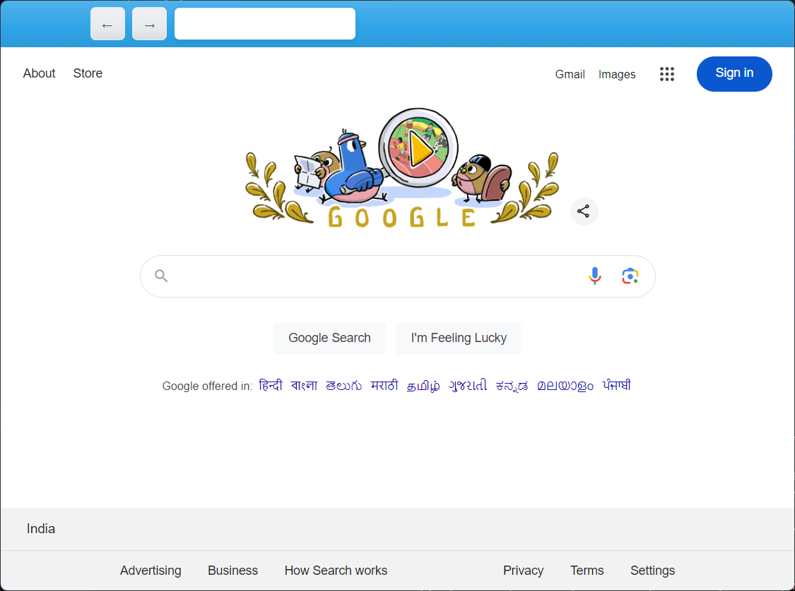

# Arishta Browser

A simple web browser built with Electron and React.



## Project Setup

### Install

```bash
$ npm install
```

### Development

```bash
$ npm run dev
```

### Build

```bash
# For windows
$ npm run build:win

# For macOS
$ npm run build:mac

# For Linux
$ npm run build:linux
```

## Resources

- [YouTube](https://www.youtube.com/watch?v=0mKPoEMAFxs)

## Credits

- [Bootswatch](https://bootswatch.com/)
- [Bootstrap Icons](https://icons.getbootstrap.com/)
- [Boilerplate](https://www.linkedin.com/pulse/building-web-browser-react-electron-miguel-rivas-perez-ja1kc/)
